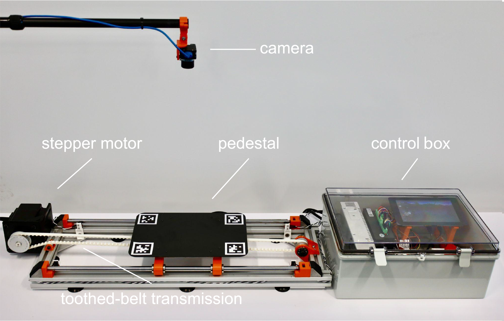
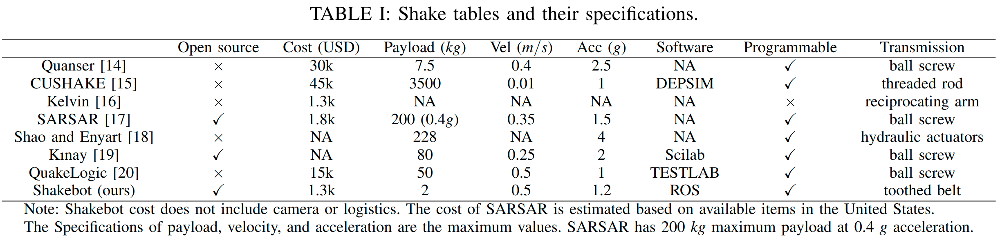
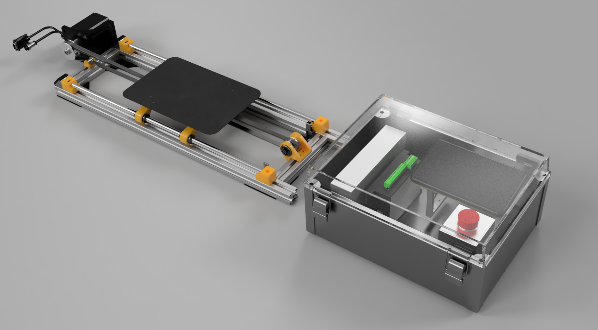
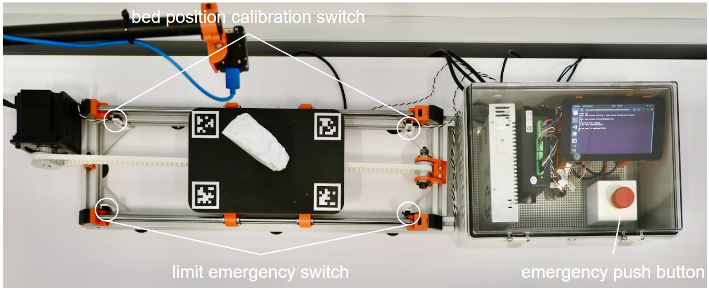
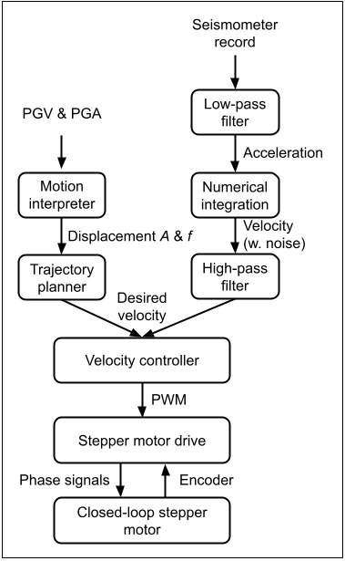

# Shakebot: a low-cost, open-source robotic shake table for earthquake research and education




Shake tables provide a critical tool for simulating earthquake events and testing the response of structures to seismic forces. However, existing shake tables are either expensive or proprietary. We present the design and implementation of a low-cost, open-source shake table named Shakebot for earthquake engineering research and education, built using Robot Operating System (ROS) and robotic concepts. The Shakebot adapts affordable and high-accuracy components from 3D printers, particularly a closed-loop stepper motor for actuation and a toothed belt for transmission. The stepper motor enables the bed to reach a maximum horizontal acceleration of 11.8 m/s^2 (1.2 g), and velocity of 0.5 m/s, with a 2 kg specimen. The Shakebot is equipped with an accelerometer and a high frame-rate camera for bed motion estimation. The low cost and easy use make the Shakebot accessible to a wide range of users, including students, educators, and researchers in low-resource settings. 


---
# Getting Started

### Github Repository Installation
```commandline
git clone --recurse-submodules https://DREAMS-lab/asu_shake_table.git
```

### Mechanical Hardware
Most of the mechanical parts and components are off-the-shelf (see below [Purchased Items](#purchased-items)), and only a few parts are 3D-printed. The 3D-printed parts can be found in the Shakebot CAD mode. We use Fusion 360. The Shakebot CAD is open-sourced via this link: https://a360.co/3cjvqjz. We also include the assembly file in our Github repository, `asu_shake_table/CAD/full_assembly_v40.zip`

### Electric Hardware
The Shakebot consists of perception and motion modules, which are included in this repository as submodules. The electric hardware setup can be found in their readme files.


Details about our the mechanical and electric hardard can be found in our paper, [Shakebot: A Low-cost, Open-source Shake Table for Ground Motion Seismic Studies](https://arxiv.org/abs/2212.10763).

### Software
The Shakebot is developed based on Robot Operating System (ROS). The software setup can be found in the readme files of the perception and motion modules. 

### Calibration
The calibration description can be found in our paper, [Shakebot: A Low-cost, Open-source Shake Table for Ground Motion Seismic Studies](https://arxiv.org/abs/2212.10763). Also, this video describes a calibration tutorial, https://www.youtube.com/watch?v=Dzq7zf9jb6s&t=278s

---
# Control system



Motion system supports two types of ground motions: single-pulse cosine displacement and realistic ground motion from seismogram acceleration recordings. Single-pulse cosine displacement is defined by peak ground velocity (PGV) and peak ground acceleration (PGA).

---
# Citation
Please cite this paper if you use the hardware or software from this work ;)
```
@article{chen2022shakebot,
  title={Shakebot: A Low-cost, Open-source Shake Table for Ground Motion Seismic Studies},
  author={Chen, Zhiang and Keating, Devin and Shethwala, Yash and Saravanakumaran, Aravind Adhith Pandian and Arrowsmith, Ramon and Madugo, Chris and Kottke, Albert and Das, Jnaneshwar},
  journal={arXiv preprint arXiv:2212.10763},
  year={2022}
}
```
---

# Purchased Items
The inventory with links can be found in the file, `asu_shake_table/CAD/inventory.xlsm`

| item                               | USD    | #  | Total   |
|------------------------------------|--------|----|---------|
| T-slot extrusion                   | 17.58  | 2  | 35.16   |
| Face mount 90 degree angle bracket | 14.91  | 4  | 59.64   |
| linear motion shaft                | 55.74  | 2  | 111.48  |
| bearing clips                      | 0.64   | 10 | 6.4     |
| bearings                           | 12.62  | 5  | 63.1    |
| corner bracket                     | 6.28   | 4  | 25.12   |
| Rubber feet                        | 13.5   | 1  | 13.5    |
| Limit swithces                     | 6.69   | 1  | 6.69    |
| rasPi                              | 148.50 | 1  | 148.5   |
| raspi 7inch touch screen           | 93.98  | 1  | 93.98   |
| SD card                            | 17.99  | 1  | 17.99   |
| raspi heat sink and fan            | 9.99   | 1  | 9.33    |
| pulley                             | 29.02  | 1  | 29.02   |
| idle pully                         | 21.17  | 1  | 21.17   |
| idle shaft                         | 8.78   | 1  | 8.78    |
| retension clip                     | 8.61   | 1  | 8.61    |
| bearing                            | 5.06   | 2  | 10.12   |
| belt                               | 4.53   | 5  | 22.65   |
| shaft nut                          | 9.14   | 1  | 9.14    |
| M5 bolt kit                        | 11.99  | 1  | 11.99   |
| correct ball bearings              | 23.80  | 4  | 95.20   |
| power cord                         | 7.41   | 1  | 7.41    |
| M5 hammer nut                      | 1.30   | 10 | 13.00   |
| standoffs                          | 1.32   | 8  | 10.56   |
| close loop stepper motor           | 146.16 | 1  | 146.16  |
| raspberry pi power supply          | 9.99   | 1  | 9.99    |
| e stop push button                 | 28.67  | 1  | 28.67   |
| accelerometer                      | 129.00 | 1  | 129.00  |
| Alloy Steel Shoulder Screws        | 4.60   | 1  | 4.60    |
| Keyboard and mouse                 | 14.99  | 1  | 14.99   |
| Ceramic capacitor                  | 12.99  | 1  | 12.99   |
| Enclosure                          | 65.99  | 1  | 65.99   |
| 2strand shielded wire              | 10.99  | 1  | 10.99   |
| jumpers                            | 6.89   | 1  | 6.89    |
| opto-isolator                      | 6.99   | 2  | 13.98   |
| total                              |        |    | 1282.79 |

